# 光线追踪渲染器

> **计算机图形学课程项目报告**

## 项目概述

本项目基于 *"Ray Tracing in One Weekend"* 系列教程，实现并改进了一个基于物理的光线追踪渲染器。主要工作包括：

| 功能模块 | 实现状态 |
|---------|:-------:|
| 多线程渲染 | ✅ 已完成 |
| 积分器改进（轮盘赌、直接光照采样、MIS） | ✅ 已完成 |
| PBR 材质系统（Cook-Torrance 微表面模型） | ✅ 已完成 |
| 多种光源（平行光、点光源、面光源、环境光贴图） | ✅ 已完成 |
| 外部模型加载 | ❌ 未实现 |
| 渲染管线优化及 GUI | ❌ 未实现 |

---

## 目录

- [1. 多线程渲染](#1-多线程渲染)
- [2. 积分器优化](#2-积分器优化)
- [3. 材质系统](#3-材质系统)
- [4. 光源系统](#4-光源系统)
- [5. 综合展示](#5-综合展示)

---

## 1. 多线程渲染

### 1.1 实现方式

采用**基于图块（Tile-based）的动态任务分配**实现多线程渲染。

**核心思想**：将整个图像分割成许多小的矩形区域（Tile），启动多个工作线程，每个线程从共享任务队列中动态获取任务，直到所有图块渲染完毕。

**动态调度的优势**：
- 渲染场景中不同区域的计算量差异很大（例如天空区域计算快，而玻璃球或焦散区域计算慢）
- 静态分配可能导致负载不均衡（如线程 A 处理完简单区域后空闲等待线程 B）
- 动态「抢任务」模式确保所有 CPU 核心始终处于忙碌状态，最大化并行效率

### 1.2 性能测试

**测试场景**：标准 Cornell Box  
**参数配置**：`samples_per_pixel = 400`，`kMaxDepth = 50`  
**渲染耗时**：18.98s

> *注：单线程基准测试数据待补充*

---

## 2. 积分器优化

### 2.1 俄罗斯轮盘赌终止策略

使用**俄罗斯轮盘赌（Russian Roulette）** 方法实现光线的自适应终止。

**核心思想**：根据光线的贡献值（吞吐量）随机决定是否终止追踪。如果决定继续追踪，则增加光线的「权重」以补偿被提前终止的光线所损失的能量，从而保持无偏估计。

#### 算法流程

假设当前光线的累积吞吐量（Throughput，即光线携带的能量/颜色权重）为 $L_o$，设定继续追踪的概率为 $P$（$0 < P < 1$）：

1. 生成一个 $[0, 1]$ 之间的随机数 $\xi$
2. **判定存活**：
   - 若 $\xi > P$（概率为 $1-P$）：光线「死亡」，终止追踪，返回 **0**
   - 若 $\xi \leq P$（概率为 $P$）：光线「存活」，继续追踪。为保持能量守恒，将光线强度除以 $P$：
     $$L_{new} = L_o / P$$

#### 动态概率策略：基于吞吐量

最佳实践是根据当前光线的「贡献度」动态调整存活概率 $P$。当光线经过多次反弹后吞吐量变低（对最终画面贡献小），应增大其终止概率。

**概率计算公式**：

$$ P = \text{Clamp}(\max(Throughput.r, Throughput.g, Throughput.b), P_{min}, P_{max}) $$

简化形式（需防止除零）：

$$ P = \max(Throughput.r, Throughput.g, Throughput.b) $$

#### 代码实现

```cpp
if (depth >= m_rr_start_depth) {
    double p_survive =
        std::max({throughput.x(), throughput.y(), throughput.z()});
    p_survive = clamp(p_survive, 0.005, 0.95);

    if (random_double() > p_survive) {
        break;
    }
    throughput /= p_survive;
}
```

#### 效果对比

轮盘赌策略能够在**不显著影响渲染质量**的前提下大幅加速渲染。

##### 测试 1：标准 Cornell Box 场景

| 无轮盘赌终止 | 使用轮盘赌终止 |
|:---:|:---:|
| 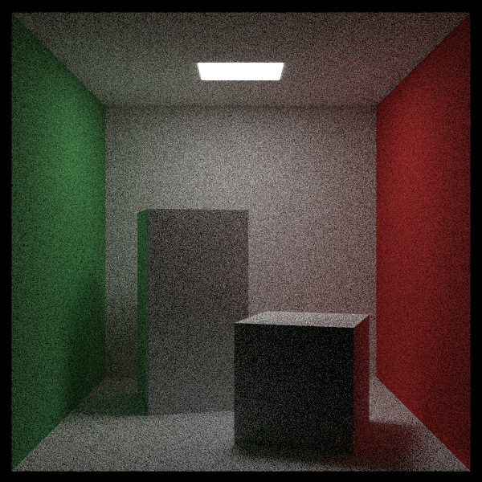 |  |
| 渲染时间：**29.2s** | 渲染时间：**11.2s** |

##### 测试 2：教程最终场景（samples_per_pixel = 500）

| 无轮盘赌终止 | 使用轮盘赌终止 |
|:---:|:---:|
| 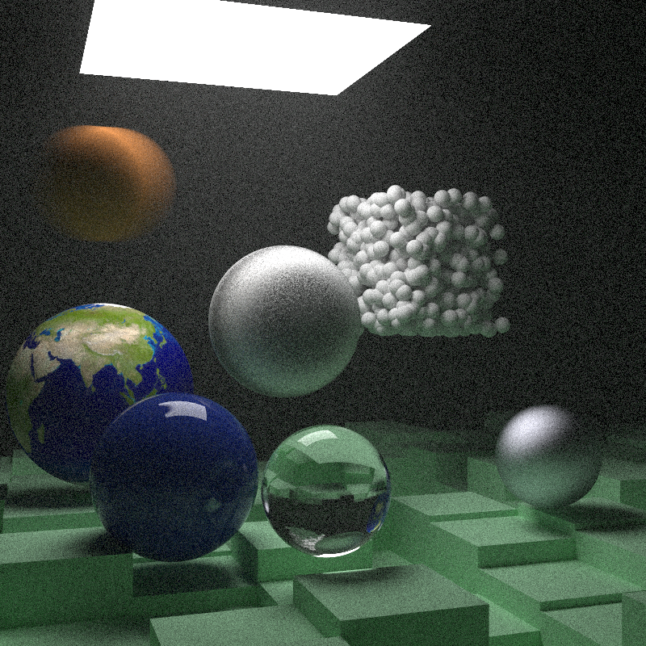 | 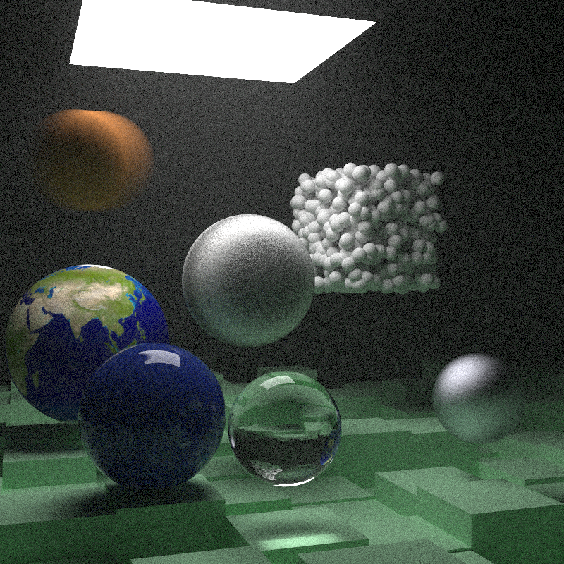 |
| 渲染时间：**164.8s** | 渲染时间：**68.7s** |

> **结论**：两者在视觉上基本没有差别，但渲染时间减少 **50% 以上**。

### 2.2 BSDF 采样支持

为支持 PBR 微表面模型材质，对积分器进行了改进以支持 **BSDF（双向散射分布函数）采样**。

**原有实现的局限性**：
- 仅支持漫反射、金属、绝缘体三种材质
- 仅实现简单的反射/折射行为

**改进后的优势**：
- 基于微表面模型，更精确地描述光线与材质的交互
- 能够更好地采样反射/折射方向，提升渲染质量

### 2.3 直接光照采样（NEE）

**问题背景**：传统光线追踪中，光线必须直接命中光源才能计算光照贡献。当光源较小时，光线难以击中光源，导致画面产生大量噪点。

**解决方案**：**直接光照采样（Next Event Estimation, NEE）** 在光线击中物体时，显式地对光源进行采样并计算直接光照贡献。

#### 效果对比

**测试参数**：`samples_per_pixel = 400`，`MaxDepth = 50`，启用轮盘赌终止

| 传统路径追踪 | 直接光照采样（NEE） |
|:---:|:---:|
|  | 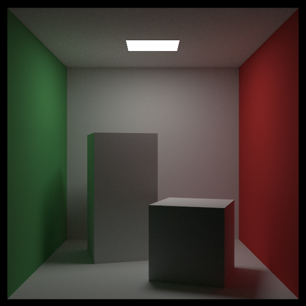 |
| 渲染时间：**10.3s** | 渲染时间：**19.1s** |

> **分析**：虽然 NEE 渲染时间较长，但噪点明显减少，同时保持了全局光照效果（如墙面颜色溢出到盒子侧面）。

### 2.4 多重重要性采样（MIS）

**NEE 的局限性**：当物体材质较为光滑时，会镜面反射大部分光线。对于大面积光源，只有一小部分区域会贡献高光。由于面光源采用均匀随机采样，很难采样到贡献高光的区域，导致高光反射不正确。

<div align="center">
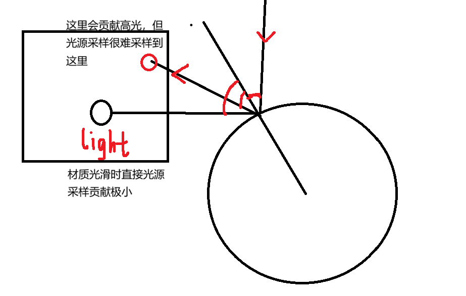
</div>

**解决方案**：引入**多重重要性采样（Multiple Importance Sampling, MIS）**，结合两种采样策略：

1. **光源采样**：显式采样光源，计算直接光照
2. **BSDF 采样**：按材质特性采样反射方向，判断是否命中光源

最终使用**幂启发式（Power Heuristic）** 对两种采样的贡献进行加权求和：

<div align="center">
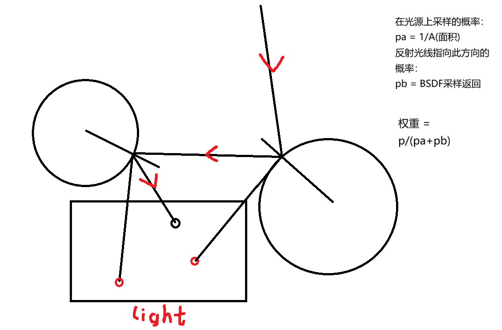
</div>

#### 效果对比

| NEE（直接光照采样） | MIS（多重重要性采样） |
|:---:|:---:|
| 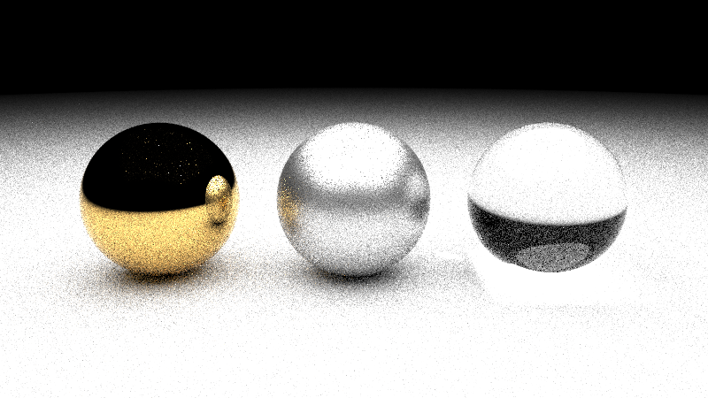 | 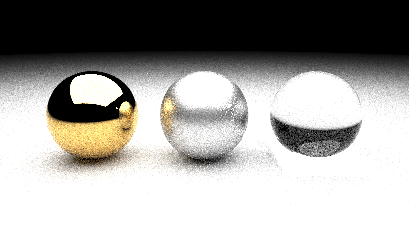 |
| 渲染时间：**1.1s** | 渲染时间：**1.3s** |

#### 细节对比

| 细节位置 | NEE（直接光照采样） | MIS（多重重要性采样） |
|:---:|:---:|:---:|
| **小球顶部** | 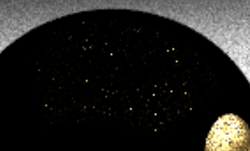 | 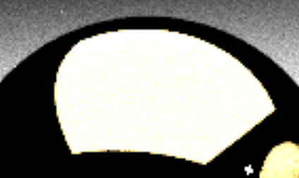 |
| **小球左侧** | 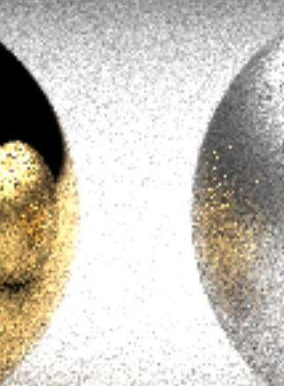 | 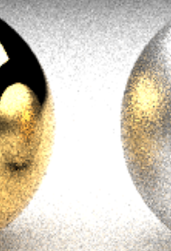 |

> **分析**：NEE 中左侧光滑小球无法正确反射顶部面光源，中间小球上的反射像也较为模糊；MIS 则能正确渲染这些高光反射。

---

## 3. 材质系统

### 3.1 材质接口设计

为支持蒙特卡洛积分和 PBR 材质，重新设计了材质接口，使其能够返回采样方向、PDF 值等必要信息。

```cpp
struct BSDFSample {
    vec3 wi; // 采样生成的入射方向
    color f; // BSDF 吞吐量, 存 f (BSDF值)，让积分器自己乘 cos 和除
             // pdf(delta材质除外)。
    double pdf;                   // 采样该方向的概率密度
    bool is_specular;             // 是否是镜面反射（Delta分布）
    bool is_transmission = false; // 区分透射
};

class material {
  public:
    virtual ~material() = default;

    // 原emitted函数（保留旧接口）
    virtual color emitted(double u, double v, const point3 &p) const {
        return color(0, 0, 0);
    }

    // 新 emitted 接口
    virtual color emitted(const hit_record &rec, const vec3 &wo) const {
        return color(0, 0, 0);
    }

    // 判断材质是否含有完美镜面（Delta 分布）成分
    virtual bool is_specular() const {
        return false;
    }

    // 采样 BSDF 生成入射方向 (Importance Sampling)
    virtual bool sample(const hit_record &rec, const vec3 &wo,
                        BSDFSample &sampled) const {
        return false;
    }

    // 给定两个方向，计算反射比率（BSDF值）
    virtual color eval(const hit_record &rec, const vec3 &wo,
                       const vec3 &wi) const {
        return color(0, 0, 0);
    }

    // 计算pdf
    virtual double pdf(const hit_record &rec, const vec3 &wo,
                       const vec3 &wi) const {
        return 0.0;
    }

    // Deprecated scatter
    virtual bool scatter(const ray &r_in, const hit_record &rec, color &albedo,
                         ray &scattered, double &pdf_val) const {
        return false;
    }

    // 保留旧接口
    virtual bool scatter(const ray &r_in, const hit_record &rec,
                         color &attenuation, ray &scattered) const {
        return false;
    }
};
```

### 3.2 PBR 材质（Cook-Torrance 模型）

采用 **Cook-Torrance 微表面模型**实现基于物理的渲染（PBR）材质。

<div align="center">

</div>

#### 模型原理

Cook-Torrance 模型假设物体表面由无数微小的、类似镜面的**微平面（Microfacets）** 组成，而非绝对光滑。

#### BRDF 公式

完整的 PBR 材质 BRDF 包含漫反射和高光反射两部分：

$$ f_r = k_d f_{diffuse} + k_s f_{specular} $$

其中高光部分 $f_{specular}$ 采用 Cook-Torrance 公式：

$$ f_{specular} = \frac{D \cdot F \cdot G}{4 (\omega_o \cdot n) (\omega_i \cdot n)} $$

| 符号 | 含义 |
|:---:|:---|
| $\omega_i$ | 光照方向（入射方向） |
| $\omega_o$ | 观察方向（出射方向） |
| $n$ | 宏观表面法线 |
| $D$ | **法线分布函数（NDF）**：描述微平面法线的统计分布 |
| $F$ | **菲涅尔方程**：描述反射率随入射角的变化 |
| $G$ | **几何函数**：描述微平面的自遮挡与阴影 |
| 分母 | 微观到宏观的几何校正因子 |

#### 材质参数化

为便于艺术家使用，采用直观的**粗糙度（Roughness）** 和**金属度（Metallic）** 参数来描述材质。

### 3.3 渲染效果展示

#### 粗糙度 × 金属度 矩阵

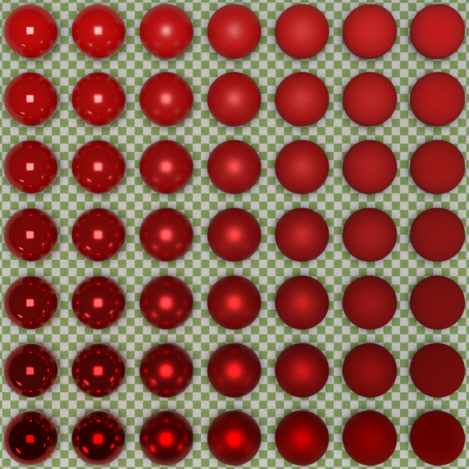

> **参数变化**：从左到右粗糙度递增，从上到下金属度递增

**观察分析**：
- **左上角**（低粗糙度 + 非金属）：高光清晰锐利，呈现塑料质感
- **左下角**（低粗糙度 + 金属）：高光同样锐利，但颜色受基础色影响，呈现金属质感
- **从左向右**：随着粗糙度增大，高光逐渐扩散、模糊

#### PBR 材质展示

| 场景 1 | 场景 2 |
|:---:|:---:|
|  | 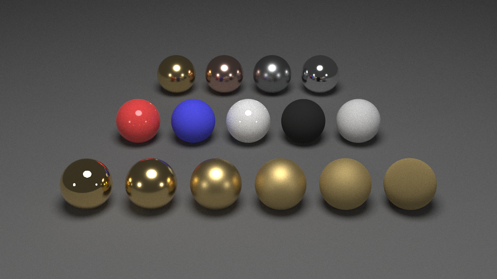 |

> 展示了不同粗糙度和颜色的金属/非金属材质，渲染结果与现实中的材质非常接近。

---

## 4. 光源系统

### 4.1 光源接口设计

```cpp
struct LightSample {
    color Li;    // 到达着色点的辐射亮度 (Radiance)，让积分器自己乘 cos 和除 pdf
    vec3 wi;     // 入射方向 (指向光源)
    double pdf;  // 采样概率密度 (通常是关于立体角的)
    double dist; // 到光源的距离 (用于阴影射线遮挡测试)
    bool is_delta; // 是否是 Delta 光源 (点光源/平行光)
};

class Light {
  public:
    virtual ~Light() = default;

    // 统一采样接口
    // u: [0,1)^2 的随机数，用于面光源采样
    virtual LightSample sample(const point3 &p, const vec2 &u) const = 0;

    // 给定方向的 PDF (用于 MIS)
    virtual double pdf(const point3 &origin, const vec3 &direction) const {
        return 0.0;
    }

    // 是否是 Delta 光源
    virtual bool is_delta() const {
        return false;
    }

    // 是否是无限远环境光源
    virtual bool is_infinite() const {
        return false;
    }

    // BSDF 命中光源时获取辐射度
    virtual color Le(const ray &r) const {
        return color(0, 0, 0);
    }

    // 功率加权选择
    virtual color power() const {
        return color(0, 0, 0);
    }
};
```

### 4.2 平行光（Directional Light）

平行光模拟无限远处的光源（如太阳光），实现时将光源距离设为无穷大，光照强度与距离无关。

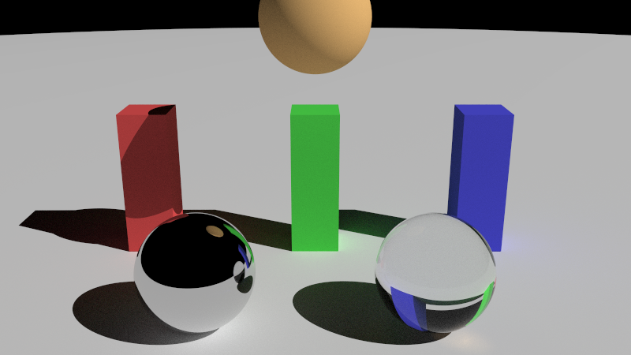

> **验证**：不同位置物体的阴影大小、方向相同，且均为硬阴影，符合平行光特性。

### 4.3 点光源（Point Light）


> **观察**：小球上可见清晰的点光源高光，阴影方向与点光源位置相关，且为硬阴影。

**萤火虫噪点问题**：图中存在明亮的噪点（Fireflies），这是由于光线偶然选择了概率极小的路径，蒙特卡洛积分按概率补偿其强度，导致返回极大数值。

**解决方案**：在积分器中截断过高的贡献值。虽然理论上会引入偏差，但对最终渲染结果影响很小。

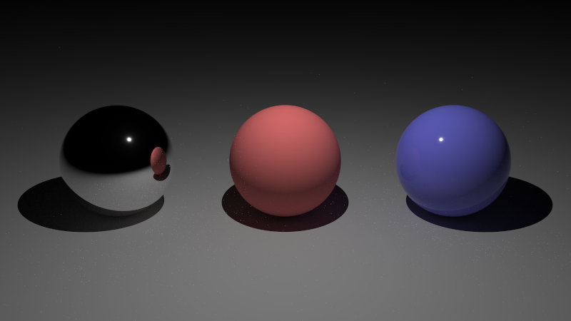

> **截断后结果**：萤火虫噪点消失，画面更加干净。

### 4.4 面光源（Area Light）

面光源产生**软阴影（Soft Shadow）**，阴影的柔和程度与物体到光源的距离、光源的尺寸有关。

| 场景 1 | 场景 2 |
|:---:|:---:|
| 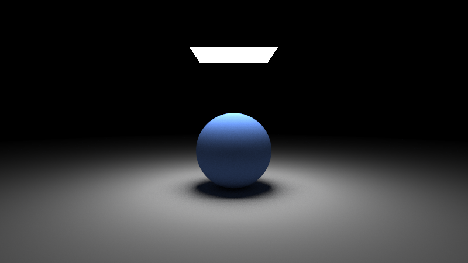 | 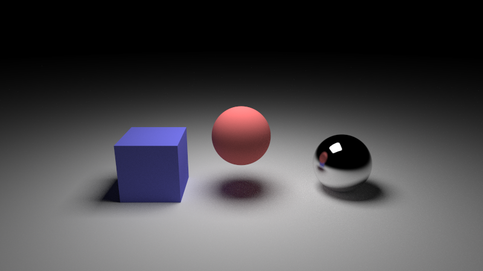 |

> **观察**：图中悬空的红色小球离面光源更近，因此其阴影边缘更模糊（半影区更大）。这符合面光源软阴影的物理特性。

### 4.5 环境光贴图（HDR Environment Map）

实现了 HDR 格式的环境光贴图，支持以下特性：

- **重要性采样**：基于 CDF（累积分布函数）优先向更亮的区域采样
- **映射模式**：支持 Light Probe（角度映射）和 Equirectangular（经纬度映射）两种格式

#### 场景展示

| 环境贴图 | 渲染结果 |
|:---:|:---:|
| 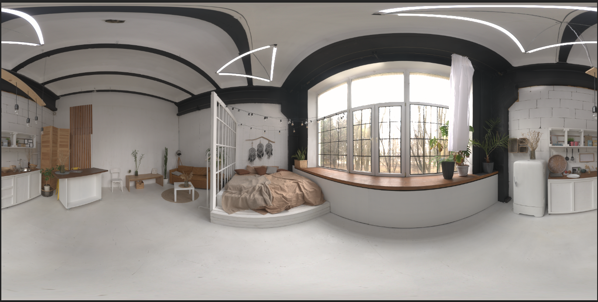 | 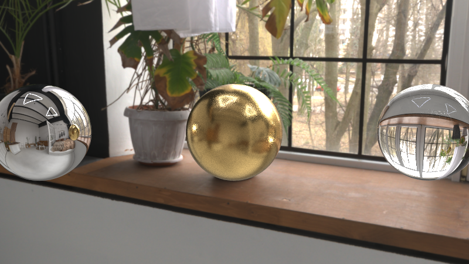 |
| **场景 1：室内** | |
| 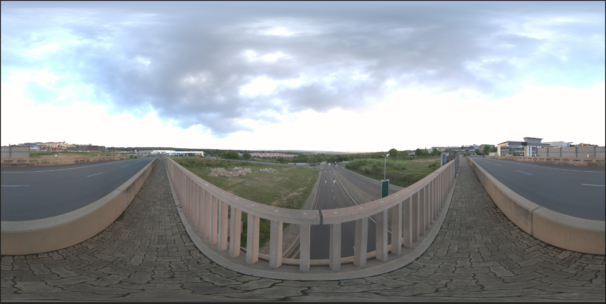 |  |
| **场景 2：室外** | |
|  | 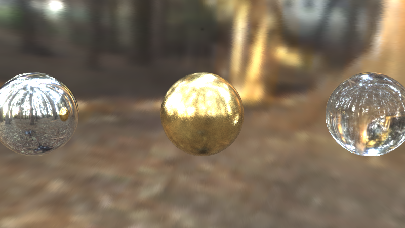 |
| **场景 3：RNL** | |
| 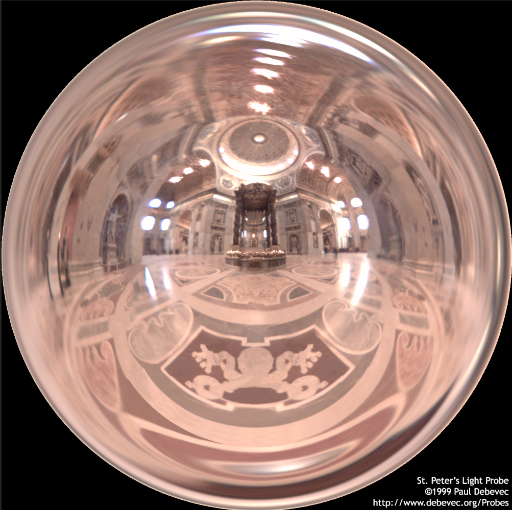 | 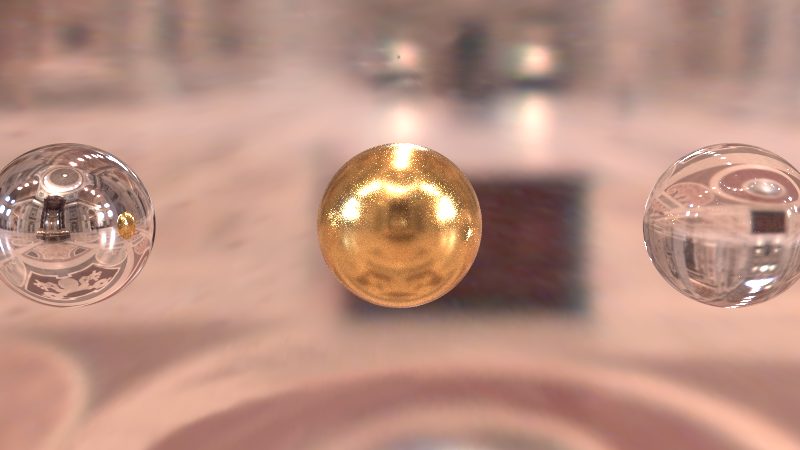 |
| **场景 4：St. Peter's** | |

> **验证**：从小球的反射可以清晰看到环境光贴图的正确映射。

---

## 5. 综合展示

### 5.1 场景 1：环境光材质展示

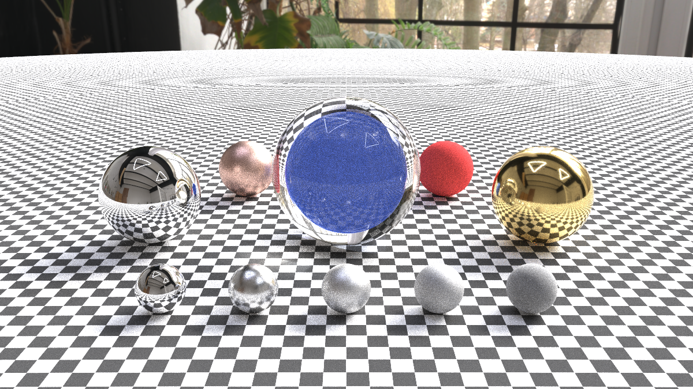

> 在 HDR 环境光照下展示不同粗糙度和金属度的材质球，体现 PBR 材质的真实感。

### 5.2 场景 2：改进版 Cornell Box

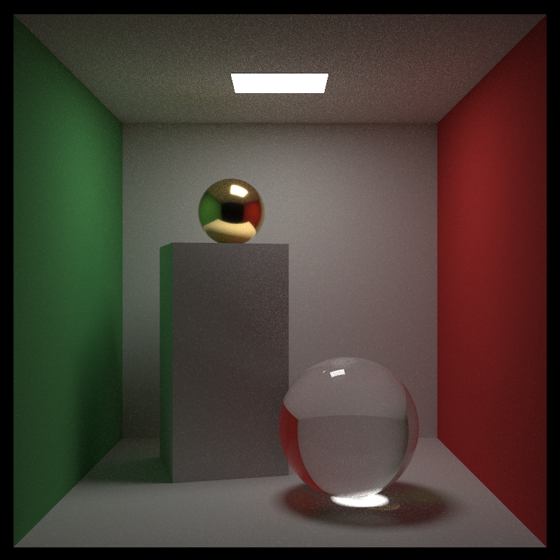

> 集中展示渲染器的核心功能：**软阴影**、**全局光照**（颜色溢出）、**玻璃折射与焦散**。

### 5.3 场景 3：多重反射

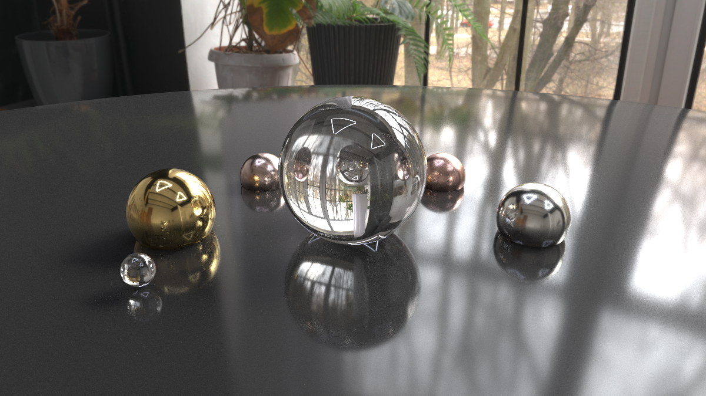

> 使用光滑非金属材质作为底座，展示环境光的**多次反射**效果，体现路径追踪的真实感。

---

## 总结

本项目实现了一个功能较为完善的基于物理的光线追踪渲染器，主要成果包括：

1. **多线程渲染**：基于 Tile 的动态任务分配，充分利用多核 CPU
2. **积分器优化**：俄罗斯轮盘赌、NEE、MIS，显著降低噪点并提升效率
3. **PBR 材质**：基于 Cook-Torrance 模型，支持粗糙度和金属度参数
4. **多种光源**：平行光、点光源、面光源、HDR 环境光贴图

渲染结果具有较好的物理真实感，能够正确模拟软阴影、全局光照、镜面反射、玻璃折射等光学现象。
