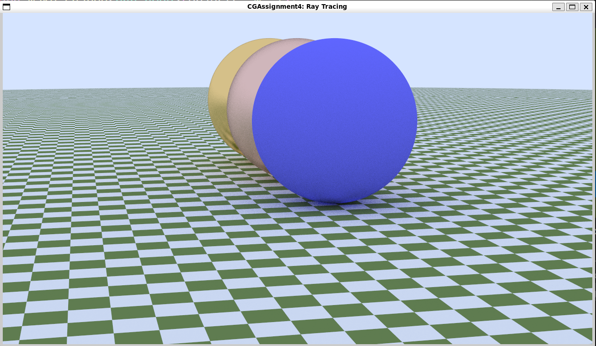

# 第三部分材质与纹理技术文档

## 涉及修改的文件结构

```
src/
├── materials/
│   ├── material.h       (重构接口，新增 PBRMaterial 类)
│   └── texture.h        (扩展纹理接口，支持标量和法线获取)
└── scene/
    ├── scenes.h         (声明新的测试场景函数)
    └── scenes.cpp       (实现 PBR 测试场景 pbr_test_scene)
```

## 1. 材质接口重构

为了支持更复杂的材质模型（如 PBR）以及未来的扩展（如多重重要性采样 MIS），我们对 `material` 接口进行了重构。

### 主要变更：
*   **新增 `eval` 接口**: 用于计算 BRDF 值。
    ```cpp
    virtual color eval(const ray &r_in, const hit_record &rec, const ray &scattered) const
    ```
    *   **含义**: 给定入射光线 `r_in`、出射光线 `scattered` 和交点信息 `rec`，计算材质的 BRDF 值。
    *   **实现逻辑**: 对于 Lambertian 材质，BRDF 为常数 $\frac{\text{albedo}}{\pi}$。代码中返回 `albedo->value(...) / pi * fmax(0, dot(rec.normal, unit_vector(scattered.direction())))`，其中包含了余弦项 $\cos\theta$。
*   **新增 `pdf` 接口**: 用于计算散射方向的概率密度函数值。
    ```cpp
    virtual double pdf(const ray &r_in, const hit_record &rec, const ray &scattered) const
    ```
    *   **含义**: 计算在给定入射方向下，采样到出射方向 `scattered` 的概率密度。
    *   **实现逻辑**: 对于 Lambertian 材质，采用余弦加权采样，PDF 为 $\frac{\cos\theta}{\pi}$。代码实现为 `dot(rec.normal, unit_vector(scattered.direction())) / pi`。
*   **更新 `lambertian` 材质**: 实现了上述新接口，使其符合物理定义。

## 2. PBR 材质实现

新增了 `PBRMaterial` 类，实现了基于物理的渲染（Physically Based Rendering）材质模型。该模型基于微表面理论，采用 Cook-Torrance BRDF 模型。

### 核心组件与实现逻辑：
*   **分布函数 (D)**: 使用 **GGX (Trowbridge-Reitz)** 分布函数。
    ```cpp
    double DistributionGGX(vec3 N, vec3 H, double roughness) const {
        double a = roughness * roughness;
        double a2 = a * a;
        double NdotH = std::max(dot(N, H), 0.0);
        double NdotH2 = NdotH * NdotH;

        double nom = a2;
        double denom = (NdotH2 * (a2 - 1.0) + 1.0);
        denom = pi * denom * denom;

        return nom / denom;
    }
    ```
    *   **含义**: 描述微表面法线与半程向量 H 对齐的概率。
    *   **逻辑**: 计算公式为 $D(h) = \frac{\alpha^2}{\pi ((n \cdot h)^2 (\alpha^2 - 1) + 1)^2}$，其中 $\alpha = \text{roughness}^2$。
*   **几何函数 (G)**: 使用 **Smith's Schlick-GGX** 几何遮蔽函数。
    ```cpp
    double GeometrySmith(vec3 N, vec3 V, vec3 L, double roughness) const {
        double NdotV = std::max(dot(N, V), 0.0);
        double NdotL = std::max(dot(N, L), 0.0);
        double ggx2 = GeometrySchlickGGX(NdotV, roughness);
        double ggx1 = GeometrySchlickGGX(NdotL, roughness);

        return ggx1 * ggx2;
    }
    ```
    *   **含义**: 描述微表面未被遮挡的比例。
    *   **逻辑**: 分别计算视线方向的遮挡 $G_1(v)$ 和光线方向的遮挡 $G_1(l)$，最终 $G = G_1(v) G_1(l)$。使用 Schlick 近似：$k = \frac{(r+1)^2}{8}$。
*   **菲涅尔方程 (F)**: 使用 **Fresnel-Schlick** 近似。
    ```cpp
    vec3 fresnelSchlick(double cosTheta, vec3 F0) const {
        return F0 + (vec3(1.0, 1.0, 1.0) - F0) * pow(1.0 - cosTheta, 5.0);
    }
    ```
    *   **含义**: 描述光线在不同入射角度下的反射比例。
    *   **逻辑**: $F(\theta) = F_0 + (1 - F_0)(1 - \cos\theta)^5$。对于金属，F0 为其反照率颜色；对于非金属，F0 通常取 0.04。

### 材质参数：
*   **Albedo (反照率)**: 基础颜色。
*   **Roughness (粗糙度)**: 控制表面的粗糙程度。
*   **Metallic (金属度)**: 控制材质是金属还是电介质。
*   **Normal Map (法线贴图)**: 支持切线空间法线贴图。

### 代码实现细节 (Scatter 函数)：
在 `scatter` 函数中，我们采用了一种简化的混合采样策略来适配路径追踪器：
```cpp
virtual bool scatter(const ray &r_in, const hit_record &rec,
                     color &attenuation, ray &scattered) const override {
    vec3 N = rec.normal;
    // 1. 法线贴图处理
    if (normal_map) {
        onb uvw;
        uvw.build_from_w(N);
        vec3 local_n = normal_map->value_normal(rec.u, rec.v, rec.p);
        N = unit_vector(uvw.local(local_n));
    }

    double rough = roughness->value_scalar(rec.u, rec.v, rec.p);
    double metal = metallic->value_scalar(rec.u, rec.v, rec.p);
    color base_color = albedo->value(rec.u, rec.v, rec.p);

    vec3 unit_dir = unit_vector(r_in.direction());
    vec3 reflected = reflect(unit_dir, N);

    // 2. 重要性采样：根据金属度选择反射类型
    if (random_double() < metal) {
        // 镜面反射 (概率 metal)
        vec3 scatter_dir = reflected + rough * random_in_unit_sphere();
        scattered = ray(rec.p, scatter_dir, r_in.time());
        attenuation = base_color;
        return (dot(scattered.direction(), N) > 0);
    } else {
        // 漫反射 (概率 1-metal)
        vec3 scatter_dir = N + random_unit_vector();
        if (scatter_dir.near_zero())
            scatter_dir = N;
        scattered = ray(rec.p, scatter_dir, r_in.time());
        attenuation = base_color;
        return true;
    }
}
```
1.  **法线处理**: 如果存在法线贴图，首先构建切线空间 (TBN)，将贴图采样的法线从切线空间变换到世界空间。
2.  **重要性采样**: 根据金属度 `metal` 进行概率选择：
    *   **镜面反射 (概率 metal)**: 模拟金属的高光反射。反射方向在理想反射方向的基础上叠加了基于粗糙度的随机扰动。
    *   **漫反射 (概率 1-metal)**: 模拟非金属的漫反射。使用 Lambertian 的余弦加权采样。
3.  **能量守恒**: 这种基于概率的分支选择自然地保持了能量守恒（蒙特卡洛积分）。

## 3. 纹理映射扩展

为了支持 PBR 材质所需的各种贴图，我们扩展了 `texture` 类及其子类。

### 接口扩展与实现：
*   **`value_scalar`**: 用于获取单通道数据（如粗糙度、金属度）。
    ```cpp
    virtual double value_scalar(double u, double v, const point3 &p) const {
        return value(u, v, p).x();
    }
    ```
    *   **实现逻辑**: 默认实现调用 `value()` 获取颜色，然后返回其 R 分量 (`.x()`)。这允许我们直接使用灰度图或将数据存储在 RGB 的某个通道中。
*   **`value_normal`**: 用于获取法线数据。
    ```cpp
    virtual vec3 value_normal(double u, double v, const point3 &p) const {
        color c = value(u, v, p);
        return unit_vector(c * 2.0 - color(1, 1, 1));
    }
    ```
    *   **实现逻辑**: 默认实现调用 `value()` 获取颜色 $(r, g, b)$，该颜色值范围在 $[0, 1]$。将其映射到法线向量范围 $[-1, 1]$，公式为 $\text{normal} = \text{unit\_vector}(2 \times \text{color} - 1)$。

### 应用：
*   **Roughness Map**: 通过 `value_scalar` 读取。
*   **Metallic Map**: 通过 `value_scalar` 读取。
*   **Normal Map**: 通过 `value_normal` 读取，并结合切线空间（TBN）变换应用到着色计算中。

## 4. 测试场景

在 `scenes.cpp` 中添加了 `pbr_test_scene` (Scene ID: 11)，用于验证 PBR 材质效果。

### 场景代码实现：
```cpp
shared_ptr<hittable> pbr_test_scene() {
    hittable_list world;

    // 地面：棋盘格纹理
    auto checker = make_shared<checker_texture>(color(0.2, 0.3, 0.1),
                                                color(0.9, 0.9, 0.9));
    world.add(make_shared<sphere>(point3(0, -1000, 0), 1000,
                                  make_shared<lambertian>(checker)));

    // 球体 1 (左)：金 (Gold)
    // Albedo: (1.0, 0.71, 0.29), Roughness: 0.2, Metallic: 1.0
    auto gold_albedo = make_shared<solid_color>(color(1.0, 0.71, 0.29));
    auto gold_rough = make_shared<solid_color>(0.2, 0.2, 0.2);
    auto gold_metal = make_shared<solid_color>(1.0, 1.0, 1.0);
    world.add(make_shared<sphere>(point3(-2, 1, 0), 1.0,
                                  make_shared<PBRMaterial>(gold_albedo, gold_rough, gold_metal)));

    // 球体 2 (中)：铜 (Copper)
    // Albedo: (0.95, 0.64, 0.54), Roughness: 0.5, Metallic: 1.0
    auto copper_albedo = make_shared<solid_color>(color(0.95, 0.64, 0.54));
    auto copper_rough = make_shared<solid_color>(0.5, 0.5, 0.5);
    auto copper_metal = make_shared<solid_color>(1.0, 1.0, 1.0);
    world.add(make_shared<sphere>(point3(0, 1, 0), 1.0,
                                  make_shared<PBRMaterial>(copper_albedo, copper_rough, copper_metal)));

    // 球体 3 (右)：塑料 (Plastic)
    // Albedo: (0.2, 0.2, 1.0), Roughness: 0.1, Metallic: 0.0
    auto plastic_albedo = make_shared<solid_color>(color(0.2, 0.2, 1.0));
    auto plastic_rough = make_shared<solid_color>(0.1, 0.1, 0.1);
    auto plastic_metal = make_shared<solid_color>(0.0, 0.0, 0.0);
    world.add(make_shared<sphere>(point3(2, 1, 0), 1.0,
                                  make_shared<PBRMaterial>(plastic_albedo, plastic_rough, plastic_metal)));

    return make_shared<bvh_node>(world, 0, 1);
}
```

### 场景选择逻辑 (select_scene)：
在 `select_scene` 函数中添加了 `case 11`：
```cpp
    case 11:
        config.world = pbr_test_scene();
        config.background = color(0.70, 0.80, 1.00);
        config.lookfrom = point3(13, 2, 3);
        config.lookat = point3(0, 0, 0);
        config.vfov = 20.0;
        break;
```

### 运行方式：
编译项目后，运行以下命令启动测试场景：
```bash
./CGAssignment4 11
```
该场景展示了不同金属度和粗糙度参数下，PBR 材质对光照的不同响应（如高光大小、反射强度）。
